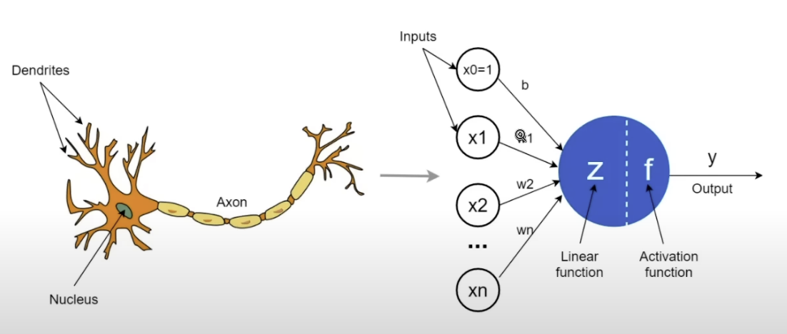
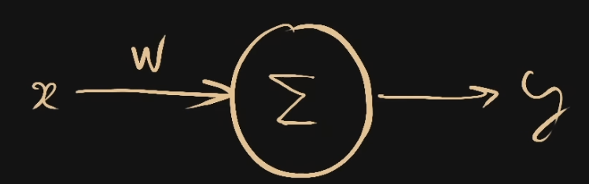
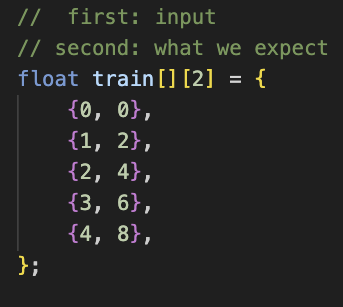
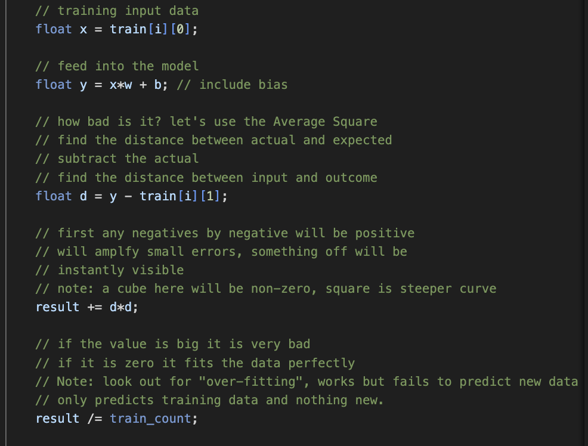
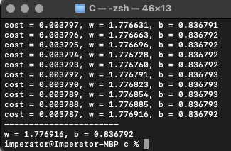
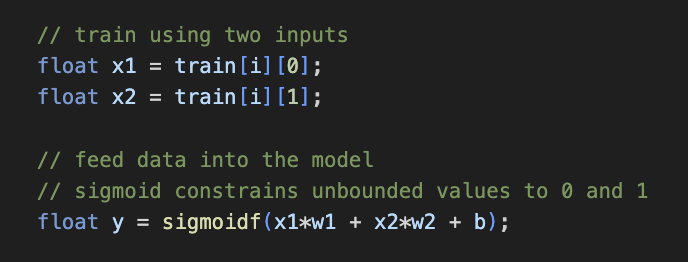
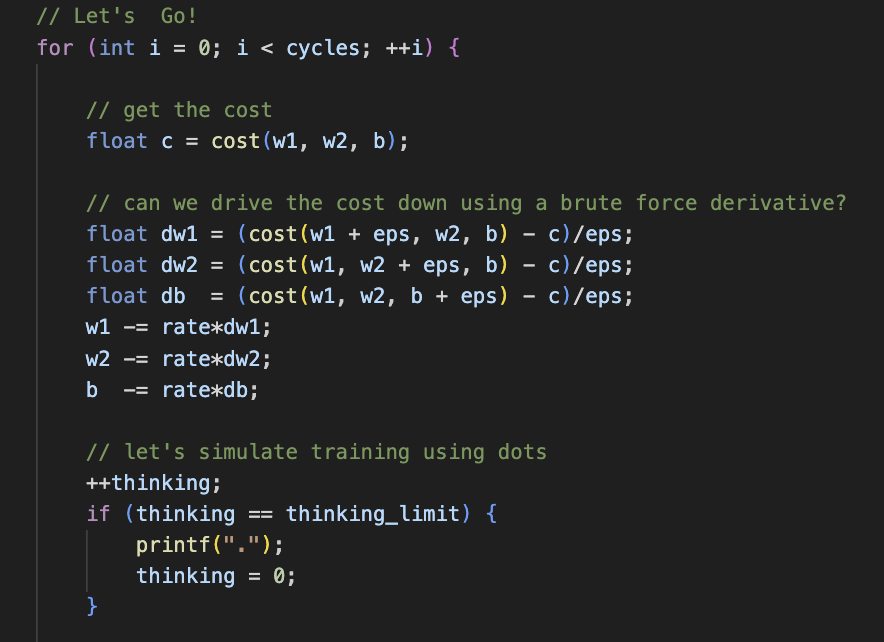
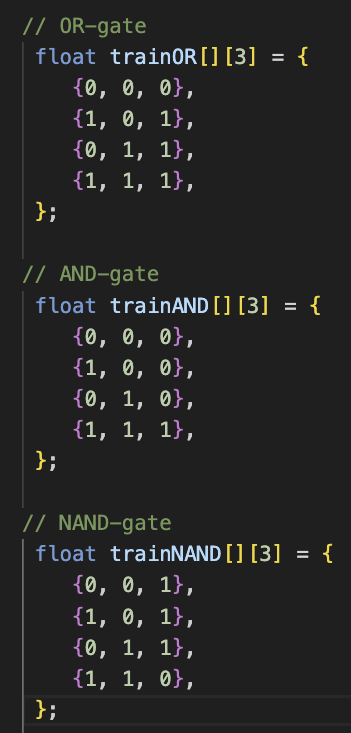
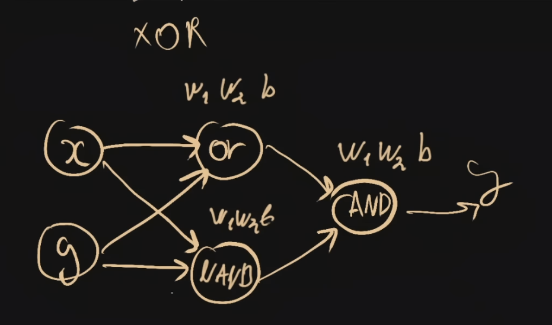

# Machine Learning in C

Let's skip all the high data science and see if we can use simple C to train a model using basic methods...

We start by building a single artifical neuron with a single input and weight.

Then we train this on some simple training data that doubles the input:

We use a simple cost function that includes an average square and bias to drive the model toward accuracy

Using this approch we can begin iterating over the cost fuction for some basic training:

But a single input can only do so much work, let's add another input and increase our power

First we update our training method to add the second weight and bind the output range using sigmoid

It is important to note how critical the added bias parameter is here for accuracy, as without it we can only drive the output based on the input parameters alone. But with a bias, the model can take the entire state of the output and shift it around left or right regardless of the inputs. 

We then construct our training method that iterates over the cost and drives it down using epsilon and a set rate as dial knobs for finer control

Now we have a single artificial neuron with two inputs which uses signmoid as an activity function to limit unbound values, and uses a bias to shift the outcome. We can now begin training on new data to model logic gates. This gives us AND, OR and NAND gate models that function well. 

This yeilds good results with one million training cycles:

One challenge is an XOR gate which can not be modeled with a single neuron. We must look to create copies of this neuron into a network to increase the processing power. Using these non-XOR gates, we can compose them into a small neural network to approximate an XOR gates function.

