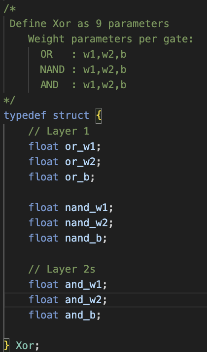
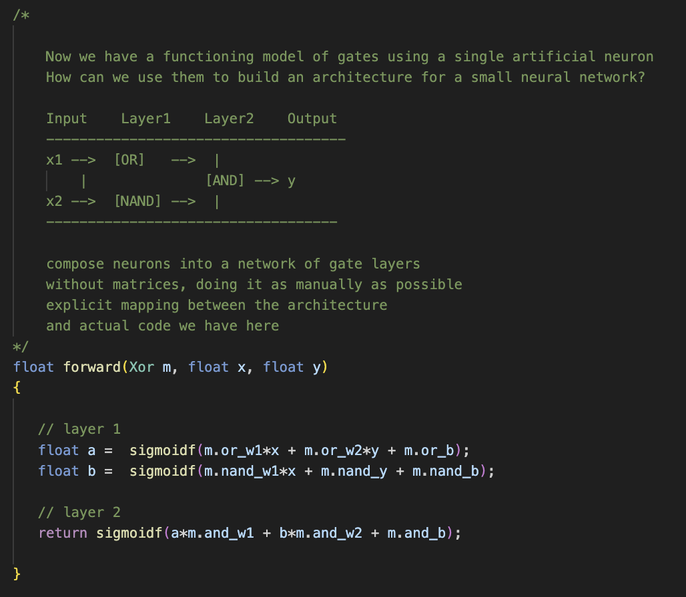
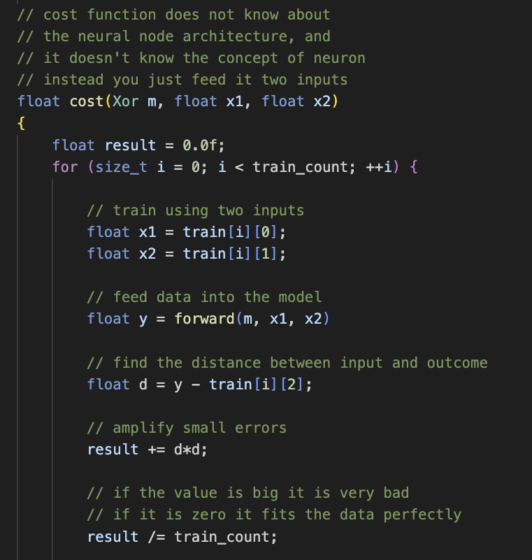
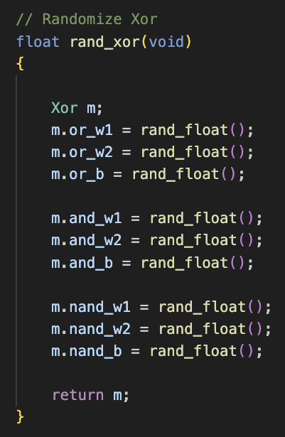
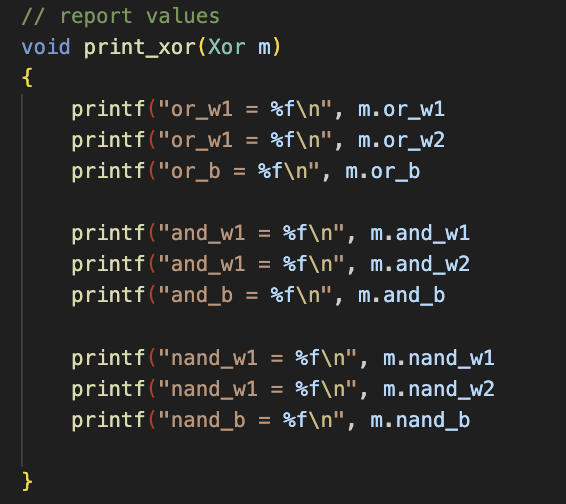
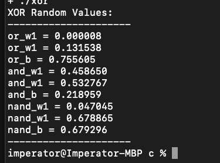
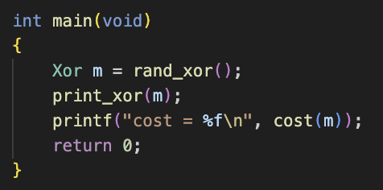
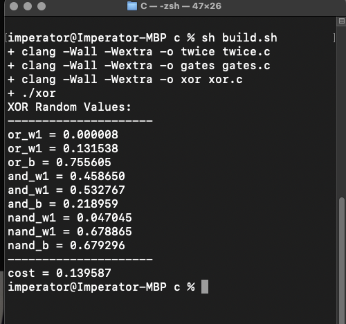

# Machine Learning in C

 <i>Note: The following is inspired by a series of long <a href="https://www.youtube.com/watch?v=PGSba51aRYU" target="_blank">Tsoding Sessions</a>, where he goes through each small step building on the last over a number of live streams I document here... His approach is to avoid the normal Data Science paths and keep things as simple as possible using C alone. I want to give a huge thanks to <a href="https://github.com/rexim">Alexey Kutepov</a> who is a demigod of the Lord's language. I highly recommend subscribing to his content and visiting his github. His dependency-free, cross-platform <a href="https://github.com/tsoding/nobuild" title="Visit repo">no build C system</a> (<a href="https://www.youtube.com/watch?v=l9_TUMZSewo" title="Watch video">watch video</a></i>) that only needs the compiler, and <a href="https://www.youtube.com/watch?v=Y57ruDOwH1g">Hot C reloading</a> are both worth checking out alone. 

  
 

Let's skip all the high level data science terms and see how we can use C to train a model using less complex maths, and learn about how ML works by stripping it down to basic elements making everything as simple as possible. 

Our first job is to start by building a single artificial neuron with a single input 'x' and weight 'w', that when summed will yield a desired outcome in 'y'. 

If this seems too abstract, instead think of the circle as a car, and 'x' input is the driver, 'w' input is the backseat driver nudging the car to the destination 'y'.

In order to use this artificial neuron to 'learn' we must give it structured input data patterns in values that we can repeat over training cycles, until we 'train' the neuron to predict the right answer. That means once trained, we can give it a unique new input, and the trained weight values drive the path of output to the correct answer. 

What we are training is actually finding the right weights and bias that consistently provides correct answers even with new input values it was never trained with.

 In this first example we do this with simple training data that doubles the input. With enough training, the model weights should be able to predict the correct answer, which is the the double of any input value without knowing the math directly. 

Now we have the data, we build a a simple <i>cost function</i> to calculate how far the guess is from the target 'y' value we want. A cost function is a mathematical concept that measures the performance of a machine learning model for a data set. It quantifies the error between predicted and expected values and presents that error in the form of a single real number.

 In this way we can feed the neuron random inputs and have it return a guess answer. The closer the cost gets to zero, the closer we are to the target answer value. We do the heavy lifting of finding the distance between guess and correct answer using an average square function, and include a bias to drive the model toward accuracy independent of input values.

Using this approach, and with random inputs values, we can begin iterating over the cost function and use the training data as our target answers. This works well enough, as the cost gets close to zero with little training.

But a single input can only do so much work, let's add another input and increase our power!

First we update our cost function to add the second input and calculate the weights correctly, then bind the output range using the sigmoid function.

It is important to note how critical the added bias parameter is here for accuracy, as without it we can only drive the output based on the input parameters alone. But with a bias, the model can take the entire state of the output and shift it around left or right regardless of the inputs. In our car analogy, the bias would be a traffic cop, who is able to shift the whole car as needed.

We then construct our training method that iterates over the cost and drives it down toward our target value using the help of epsilon and a set rate as dial knobs we can alter for better results.

Now we have a single artificial neuron with two inputs, two weights, which uses sigmoid as an activity function to limit unbound values, and a bias to shift the outcome as needed. We can now begin training on new data to do real work. Let's start with truth tables to model logic gates. This data allows us to train AND, OR and NAND gate models. 

 

This yields good results with one million training cycles:

Although we are not exactly at 1, we are very close and can use above and below .5 to calculate the answer from the model output.

One challenge is an XOR gate which can not be modeled with a single neuron alone. We need to design an architecture to reuse our neuron and build a small neural network to increase the processing power and compose our gates to do work together.

Using our trained non-XOR gate models, we can compose them into a small neural network to approximate an XOR gate.

We are not sure at this point if this is the correct pattern yet, but we can allocate enough neurons for a small network that can  begin to find the solution with.  Each gate will have two weights and a bias which increases the total number of our parameters from two to nine.

To deal with nine parameters we will create a new structure, which will account for AND, OR and NAND associated weights and bias for each.

 
Next we create a forward function to arrange the nodes in the network and forward the input data through the layers in the architecture.  

Notice how each gate component is assigned a layer in the architecture. The data will flow first through the first layer comprised of both OR and NAND gates, then through the second layer AND gate respectively. All output values are bound to 0 and 1 with the sigmoid function.

Next we define our XOR training data

Now that we have the data, we need to update the cost function, this time we will pass in the whole model (Xor) and use the forward function.

Before we had two inputs to randomize, with nine it is a bit more challenging so let's write a function to handle that too:

and a simple way to report the values

Running what we have so far gives us some values to start with

 

Put it all together.. 

Now that we have all the key elements in place the moment of truth, we can now run our model and see the results...

 

